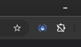
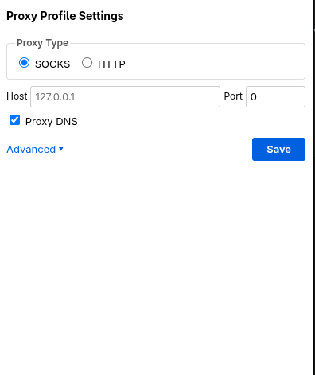
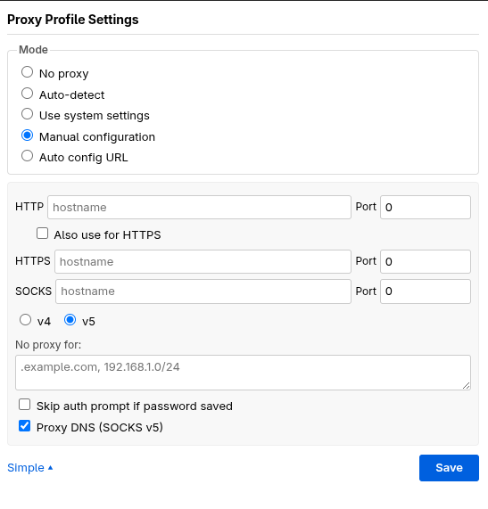

<p align="center">
  
</p>

<h1 align="center">Proxy Profile Switcher</h1>

<p align="center">
  A lightweight browser extension for quickly switching between proxy configurations.
</p>

<p align="center">
  <a href="https://github.com/mohammadhzp/proxy-profile-switcher/blob/main/LICENSE">
    
  </a>
  
  = 109">
  
</p>

---

## About

Proxy Profile Switcher lets you manage proxy settings directly from your browser toolbar. Click the icon to cycle through proxy modes, or right-click to open the full settings panel. It supports HTTP, HTTPS, and SOCKS proxies with both a simple and an advanced configuration view.

## Features

- **Quick mode cycling** &mdash; click the toolbar icon to rotate between *no proxy*, *system settings*, and *manual proxy*
- **Simple mode** &mdash; configure a single SOCKS or HTTP proxy with one click
- **Advanced mode** &mdash; separate HTTP, HTTPS, and SOCKS proxy settings, PAC URL support, passthrough list, and more
- **SOCKS v4/v5** support with optional DNS proxying
- **Auto-login** &mdash; skip the auth prompt when credentials are saved
- **Cross-browser** &mdash; works on Firefox (109+) and Chrome/Chromium-based browsers
- **Persistent settings** &mdash; your configuration is saved and restored automatically on browser startup

## Demo

### Toolbar Icon

The extension adds an icon to the browser toolbar that changes based on the active proxy mode.

<p align="center">
  
</p>

### Simple Mode

A streamlined view for quick proxy setup &mdash; choose SOCKS or HTTP, enter a host and port, and save.

<p align="center">
  
</p>

### Advanced Mode

Full control over proxy configuration including per-protocol settings, PAC URLs, passthrough rules, and SOCKS version selection.

<p align="center">
  
</p>

## Install

<p align="center">
  <a href="https://addons.mozilla.org/en-US/firefox/addon/easy-proxy-profile-switcher/">
    
  </a>
  &nbsp;&nbsp;

[//]: # (  <a href="https://chromewebstore.google.com/detail/<EXTENSION_ID>">)

[//]: # (    )

[//]: # (  </a>)
</p>

### Firefox

Install from the [Firefox Add-ons Store](https://addons.mozilla.org/en-US/firefox/addon/easy-proxy-profile-switcher/) or manually:

1. Download the latest `.zip` from the [Releases](https://github.com/mohammadhzp/proxy-profile-switcher/releases) page.
2. Open `about:addons` in Firefox.
3. Click the gear icon and select **Install Add-on From File...**.
4. Select the downloaded `.zip` file.

### Chrome / Chromium

Install manually:

1. Download or clone this repository.
2. Open `chrome://extensions/` and enable **Developer mode**.
3. Click **Load unpacked** and select the project directory.

> A one-time registration fee in amount of \$5 is required in order to register as a Chrome Web Store Developer.
> otherwise I won't be able to publish on chrome-store.
> Please contact me if you can support me to publish the extension on chrome store.
## Usage

| Action | Result |
|--------|--------|
| **Left-click** the toolbar icon | Cycle through proxy modes (none &rarr; system &rarr; manual) |
| **Right-click** the toolbar icon | Open the settings popup |
| Toggle **Simple / Advanced** | Switch between quick setup and full configuration |
| Click **Save** | Persist your settings and apply the proxy immediately |

## Project Structure

```
proxy-profile-switcher/
├── manifest.json        # Extension manifest (v3)
├── main.js              # Background service worker
├── proxy.js             # Core proxy configuration logic
├── popup.html           # Settings popup UI
├── popup.js             # Popup event handling
├── icons/               # Extension icons (toolbar states)
├── demo/                # Screenshots
├── build/               # Packaged extension
└── LICENSE
```

## Contributing

Contributions are welcome! Please open an issue or submit a pull request on [GitHub](https://github.com/mohammadhzp/proxy-profile-switcher).

## License

This project is licensed under the [MIT License](LICENSE).

&copy; 2026 Mohammad Puyandeh
